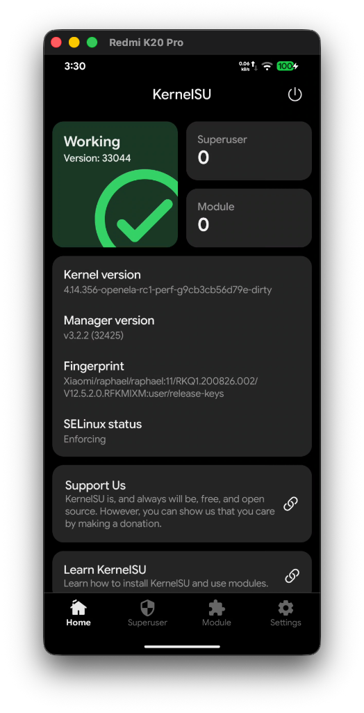
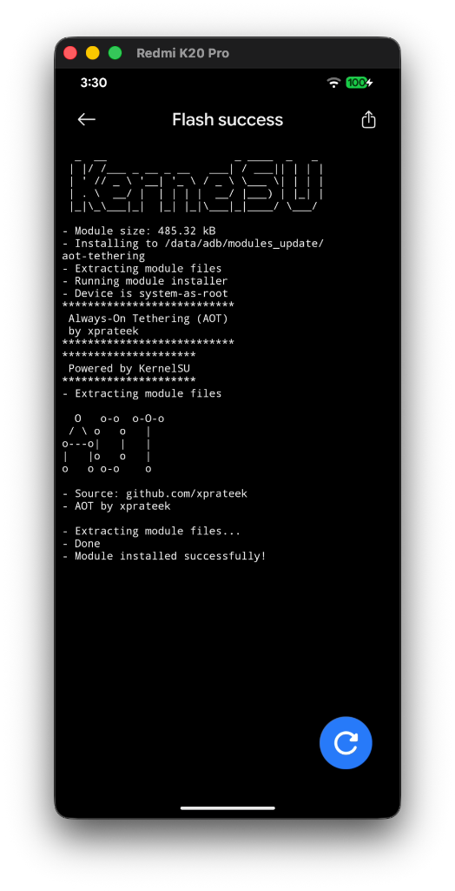
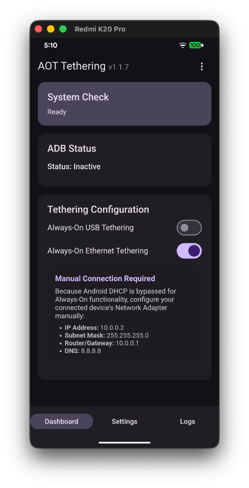
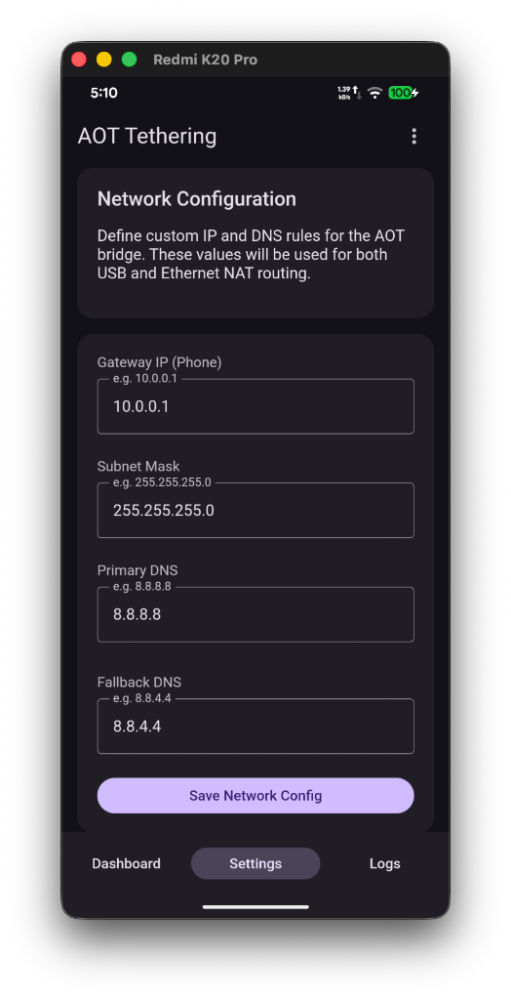
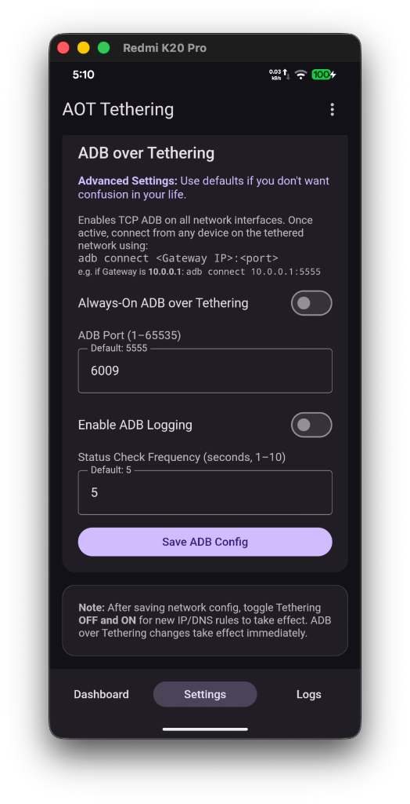
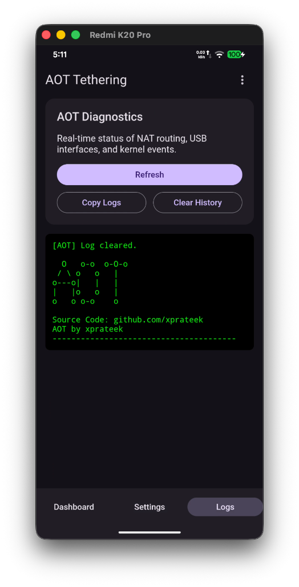
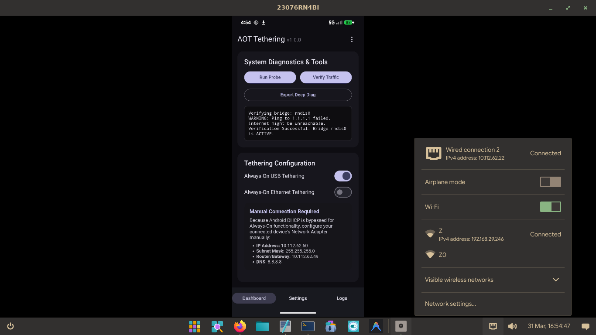
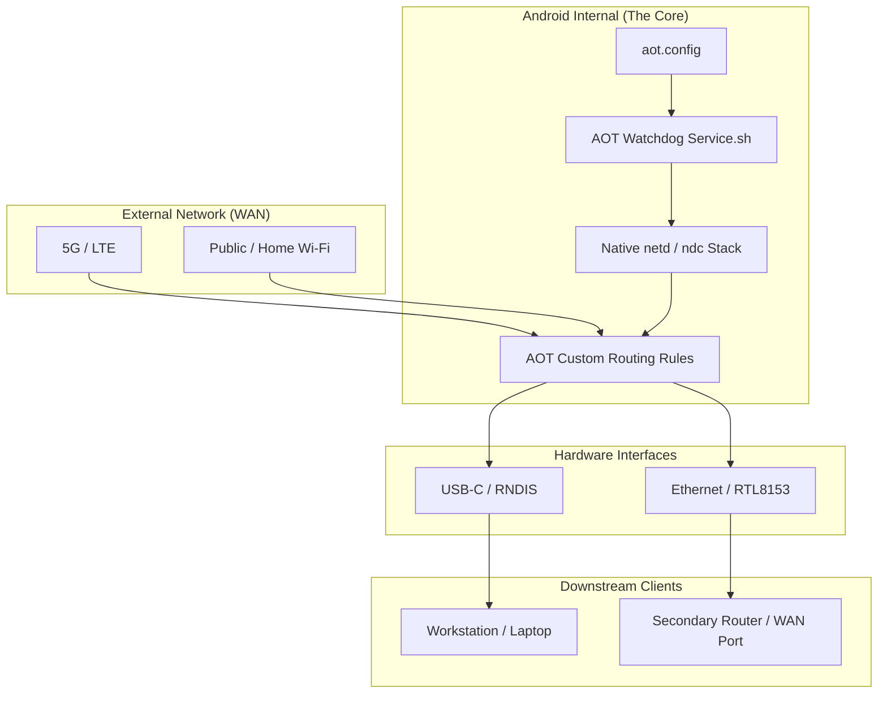

# Always-On Tethering (AOT) 

```


  O   o-o  o-O-o 
 / \ o   o   |   
o---o|   |   |   
|   |o   o   |   
o   o o-o    o  
                      
Always-On Tethering (AOT) v1.0.0

```

Always-On Tethering (AOT) is a professional-grade networking module for Android (KernelSU, Magisk, APatch) designed to provide a persistent, high-performance NAT bridge for USB and Ethernet tethering.

### ⚙️ V1.0.0 Detailed Information
AOT v1 transforms your Android device into a production-ready router. By leveraging the native Android `ndc` (netd) stack, it ensures a stable and automated DHCP environment. Key enhancements include:
- **State-Aware Watchdog**: Monitors bridge health every 10s and performs smart repairs without disrupting ADB.
- **Double-Lock Networking**: Zero-tolerance for malformed IP assignments, ensuring a reliable 10.0.0.1 gateway.
- **Boot-Time Restoration**: Saves your last known state and automatically restores tethering 120s after boot.

### 🤝 Contribution & PR Policy
I am still learning! If you'd like to help improve this project, please create a **Pull Request**. I will happily merge any PR that works as intended without a formal review process. Your feedback and code are always welcome! 

---

## 📸 Screenshots

| KernelSU Integration | Installation | Tethering Setup |
| :---: | :---: | :---: |
|  |  |  |

| Network Configuration | ADB Configuration | Real-time Diagnostics |
| :---: | :---: | :---: |
|  |  |  |

---
AlmaLinux 10.1 | Cosmic DE (PRE_REL BUILD)
 

---

## 🚀 Core Features

### 📡 Native Tethering Stack (ndc)
Unlike standard scripts that only manipulate `iptables`, AOT utilizes Android's native **`ndc` (netd client)** to trigger the full system tethering stack.
- **Automatic DHCP**: Devices connected via USB or Ethernet receive IP addresses automatically from the phone's built-in DHCP server (`dnsmasq`).
- **One-Touch Connectivity**: No manual static IP configuration required on the client side.

### 🛡️ Persistence & Bypass
- **🔄 Watchdog (5s)**: A background monitor ensures the bridge survives reboots, cable disconnects, and power state changes.
- **🛠️ Policy Routing Bypass**: Uses `priority 5000` rules to route traffic through the active WAN (Wi-Fi or Cellular), bypassing provider blocks.
- **⚡ Performance NAT**: Directly handles `iptables` MASQUERADE for maximum throughput (800Mbps+ depending on hardware).

### 🛰️ Integrated ADB over Tethering
- **Always-On TCP ADB**: AOT enables ADB over TCP (`setprop service.adb.tcp.port`) which binds `adbd` to **all network interfaces simultaneously** — including the tethering bridge IP.
- **Accessible via Gateway IP**: If your Gateway is set to `10.0.0.1` (Ethernet/USB tethering) and a router/PC is connected downstream, you can connect via:
  ```bash
  adb connect 10.0.0.1:5555
  ```
- **No Wi-Fi Required for ADB**: ADB works over the tethered interface (`rndis0` for USB, `eth0` for Ethernet). The physical USB port is used for data routing but ADB operates on the TCP port.
- **USB Mode**: When USB tethering is active, `sys.usb.config` is set to `rndis,adb` — both data routing and ADB are active simultaneously.
- **Headless Diagnostics**: Wirelessly diagnose your phone-as-router from any device connected downstream.

### ⚙️ Customizable Configuration
- **Dynamic DNS**: Redirect all tethered traffic (port 53) to custom DNS servers (Cloudflare, Google, AdGuard, etc.) via the WebUI.
- **Custom Gateway**: Define your own phone-side bridge IP and subnet mask.

---

## 🏗️ Architecture

- **`aot-cli.sh`**: The core routing engine leveraging the native Android `ndc` stack + custom AOT overlays.
- **`service.sh`**: Unified background monitor for both tethering and Wi-Fi ADB persistence.
- **Dashboard**: Material Design 3 WebUI for managing everything from your module manager.

---

## 🤝 Acknowledgments & Credits

Developed and maintained by **xprateek**.

- **Wi-Fi ADB**: Based on the concept by **mrh929** (MagiskWiFiADB).
- **Inspiration**: Special thanks to **Vijay @indianets** for conceptual suggestions.
- **WebUI foundation**: Inspired by and built upon the **Bindhosts** project.
- **Root Support**: Powered by **KernelSU**, **Magisk**, and **APatch**.

---

### 📄 License
WTFPL - Do What the Fuck You Want to Public License.---

## 🏗️ Architecture & System Overview

AOT transforms your Android device into a professional-grade, persistent router that doesn't rely on the standard Android Settings UI.

### 🎨 Logic & Flow Diagram


### 🛡️ Recovery & Accessibility Use-Cases

| Scenario | Standard Experience | The AOT Advantage |
| :--- | :--- | :--- |
| **Broken Screen** | Cannot toggle Tethering | **Auto-Start**: Instant persistent bridge on boot. |
| **ADB-Only Mode** | Unknown IP address | **Fixed Gateway**: Always reachable via `10.0.0.1` (default). |
| **Headless Shell** | No Wi-Fi access | **TCP ADB Over Bridge**: `adb connect 10.0.0.1:6009` |

> [!IMPORTANT]
> **Secondary Router Setup**: If connecting AOT to a secondary router's WAN/LAN port, you **MUST disable DHCP** on that router. This ensures your downstream devices correctly receive their IP and DNS assignments directly from the phone's high-performance AOT DHCP server.

### ⚙️ How it Works
1. **The Watchdog**: `service.sh` monitors the bridge health every 5 seconds.
2. **Native Stack**: Uses Android's native `ndc` (netd) for enterprise-grade DHCP/DNS.
3. **WAN Bypass**: Forces routing through the primary WAN interface, bypassing carrier tethering restrictions.

---
